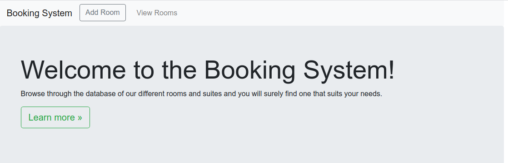
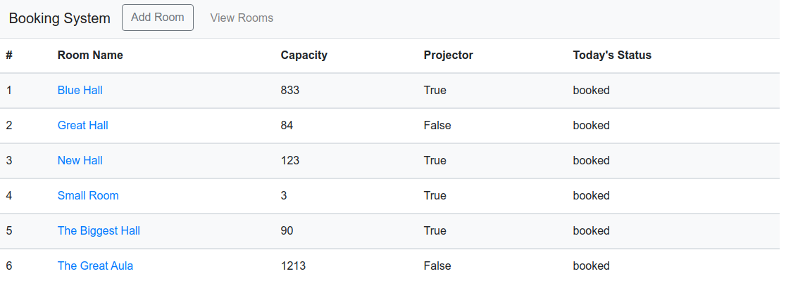
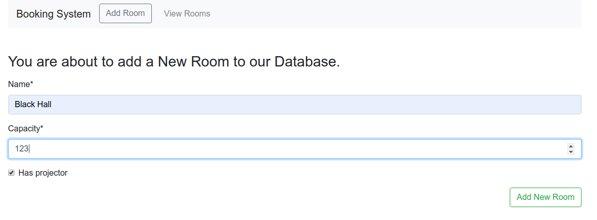
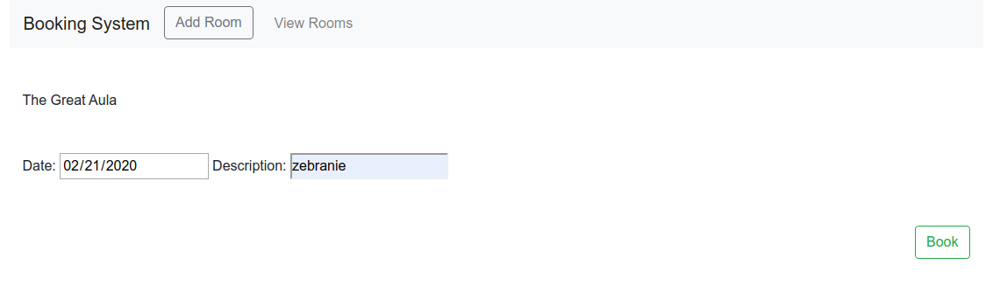
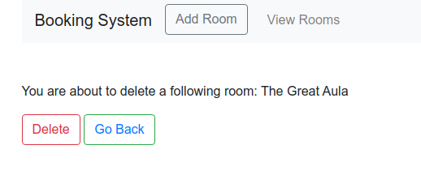
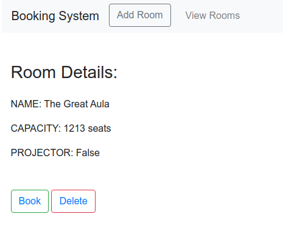

# Room booking project

A simple web application for bookig rooms. Technologies used: 
`Python` 
`Django` 
`Postgresql` 
`HTML` 
`Bootstrap`
`Pipenv`
`Git`

# Main app features

* booking rooms
* adding new rooms
* editing existing rooms
* deleting rooms
* displaying one or all rooms data
* room searching

# App screenshots:

* Home

* All rooms

* Add room form

* Book room view

* Delete room

* One room

# Author

Marcel Łagoda  
marceli.lagoda@gmail.com