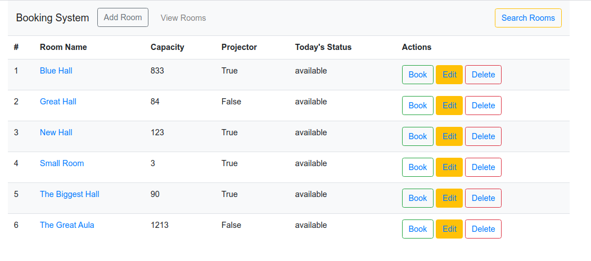
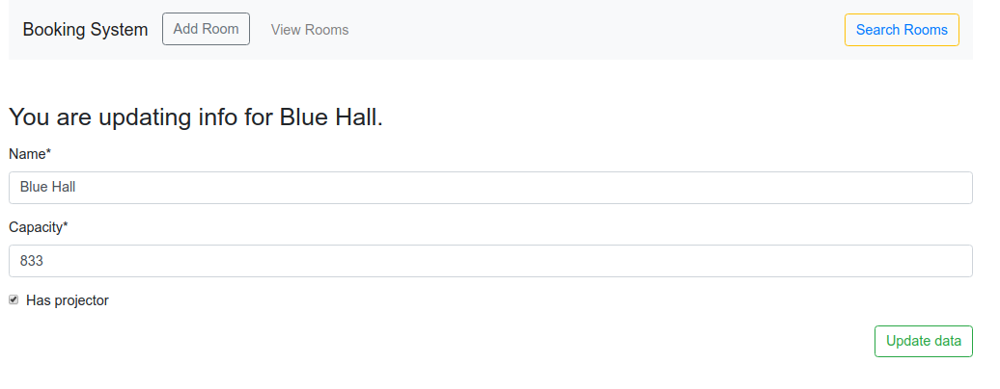

# Room booking project

A simple web application for bookig rooms. Technologies used:   
`Python`  
`Django`  
`Postgresql`  
`HTML`  
`Bootstrap` 
`Pipenv` 
`Git`

# Main app features

* booking rooms
* adding new rooms
* editing existing rooms
* deleting rooms
* displaying one or all rooms data
* room searching

# App screenshots:

Home

All rooms

Search rooms

Add room form

Book one room view

Delete room

Edit room

# Author

Marcel Łagoda  
marceli.lagoda@gmail.com